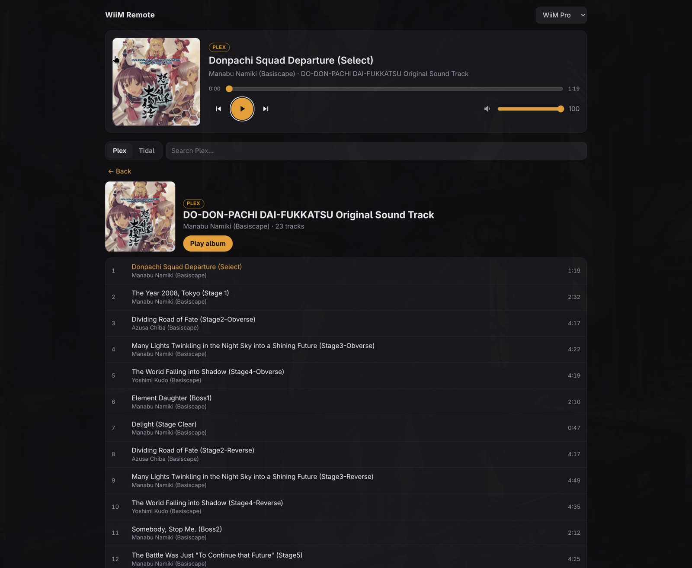

# linux-wiim

A small web app for controlling WiiM streamers (WiiM Amp, WiiM Pro) from Linux,
where WiiM makes no desktop app. It shows what each device is playing and plays
music from a Plex server or Tidal on it.

> Unofficial. Not affiliated with or endorsed by WiiM, Linkplay, Plex or TIDAL.



- **Now playing:** artwork, title, artist and album, with seek, play/pause,
  next/previous and volume. Click the artwork to open that album.
- **Plex:** recently added, all albums, search, album and artist pages.
- **Tidal:** saved albums, search, album and artist pages.
- **Albums** play in order through a queue kept by the server.
- **Navigation:** every page is a browser history entry, so the mouse back button
  and the phone's back gesture work.
- **Media keys:** the playing WiiM is published as an MPRIS player, so the
  keyboard's play/pause, next and previous control it, and the desktop shows the
  track and artwork. The name is claimed only while a device has a track, so an
  idle WiiM Remote doesn't take the keys from other players.

## How it works

Devices are found over mDNS (`_linkplay._tcp`). The server controls them through
the WiiM HTTP API (`https://<ip>/httpapi.asp`) and UPnP AVTransport. To play a
track, it passes the stream URL to the device with `SetAVTransportURI`, along with
DIDL-Lite metadata so the WiiM's own app shows the title and artwork too.

- **Plex:** the direct file URL on your LAN. The token stays on the server, and
  the browser gets artwork through a proxy.
- **Tidal:** [`tidalapi`](https://github.com/tamland/python-tidal) at 16-bit lossless,
  which Tidal serves as FLAC inside MP4. Hi-res comes as DASH, which the WiiM
  can't play over UPnP. For hi-res, use the WiiM app's built-in Tidal.

## Setup

Requires Python 3.10+, a Plex Media Server, and `avahi-browse` (the `avahi` package)
for discovery. A Tidal subscription is only needed for the Tidal tab.

```bash
python3 -m venv .venv
.venv/bin/pip install -r requirements.txt
.venv/bin/python login_plex.py     # enter the code at https://plex.tv/link
.venv/bin/python login_tidal.py    # open the printed link (expires in 5 minutes)
.venv/bin/python app.py            # http://localhost:8765
```

Credentials are stored in `~/.config/wiim-remote/` with mode 600, outside the repo.

### Plex server address

Two addresses matter:

- **`PLEX_URL`** is where this app calls the Plex API. It defaults to
  `http://127.0.0.1:32400`, a server on the same machine.
- **The address the WiiM streams from.** The device fetches tracks itself, so this
  must be reachable from it. When Plex runs on the same machine, the app uses this
  machine's own address on the route to the device. When `PLEX_URL` is a remote
  host, it uses that. Set **`PLEX_LAN_URL`** to override it, for example when Plex
  runs in a container.

### Run as a service

```bash
cp wiim-remote.service ~/.config/systemd/user/   # edit the paths if you didn't clone to ~/linux-wiim
systemctl --user enable --now wiim-remote
loginctl enable-linger "$USER"                   # keep it running without a login session
```

## Security

**There is no authentication.** Anyone who can reach port 8765 can control your
speakers and browse your libraries (but can't see your tokens). Keep it on a
trusted LAN or VPN, such as Tailscale, and never expose it to the internet. To
allow other machines on your LAN, open TCP 8765 to your LAN only:

```bash
sudo ufw allow proto tcp from 192.168.1.0/24 to any port 8765   # use your LAN's range
```

## Caveats

- `tidalapi` is an unofficial Tidal client. It can break when Tidal changes its
  API, and its use may not be permitted by Tidal's terms.
- When the app drives a WiiM over UPnP, the device holds one URL at a time. Album
  queues therefore live in the server: they're lost if it restarts, and the WiiM
  app's own next button doesn't know about them.

## License

MIT
